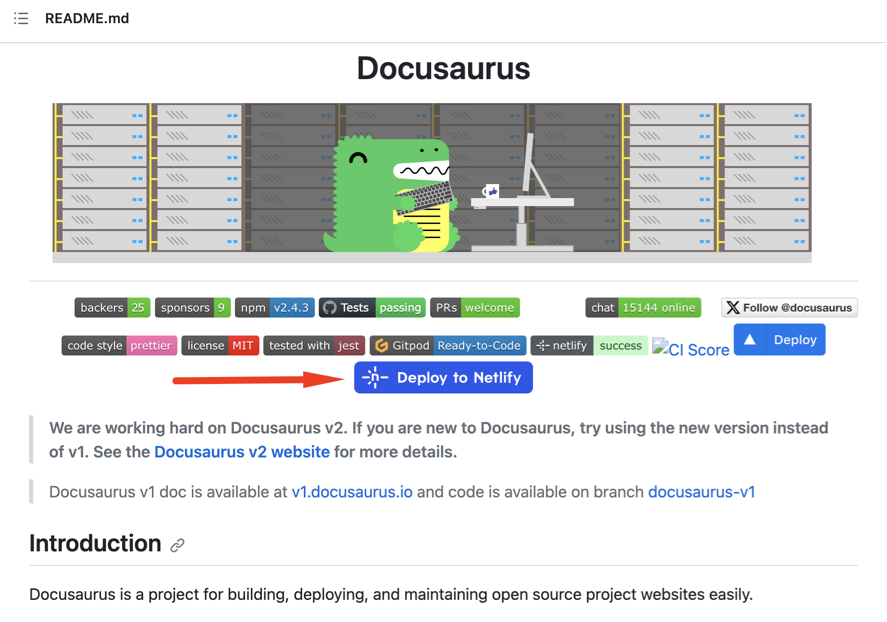

# Step-by-Step Guide to Create a Docusaurus Website

In this guide, we'll walk through the process of creating a Docusaurus website, a modern static website generator, step by step.

## Step 1: Create a GitHub Account

You will need a GitHub account. If you don't have this, create one [here](https://github.com/signup) .

## Step 2: Create a Netlify Account

You'll also need a Netlify account. You can sign up using your GitHub account [here](https://app.netlify.com/signup) .

## Step 3: Deploy to Netlify

Open this repo, and click the blue "Deploy to Vercel" button.

## Step 4: XX